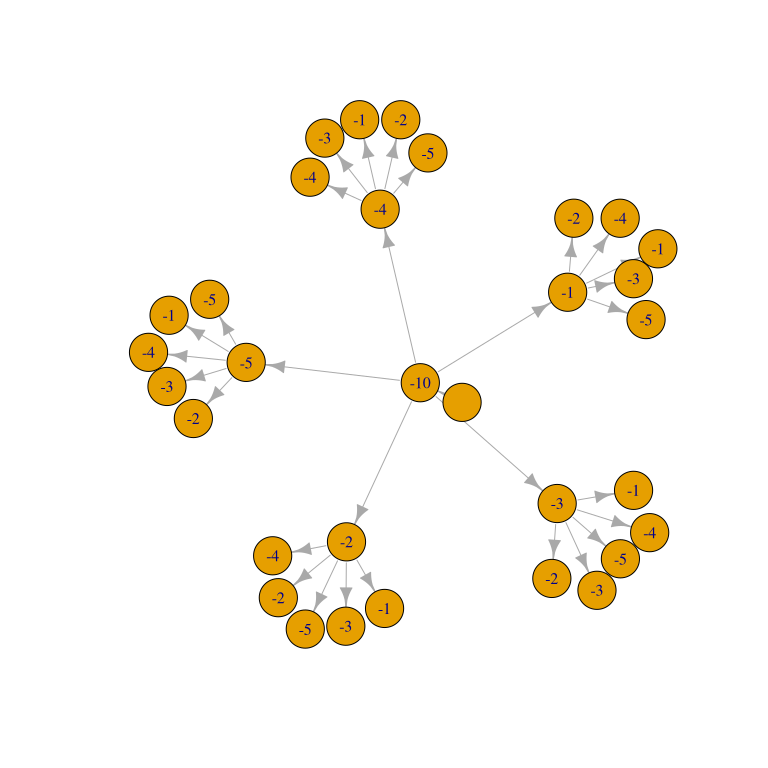
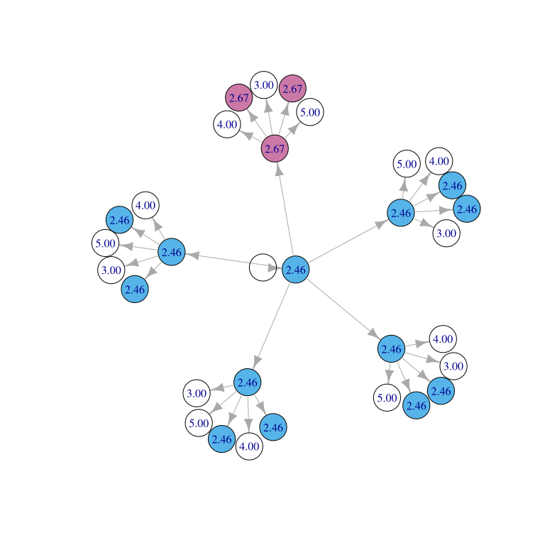

<!-- README.md is generated from README.Rmd. Please edit that file -->

# wmms

<!-- badges: start -->

<!-- badges: end -->

Prune a tree to be the most profitable possible subtree that is still
connected to the root node. If every node has two numeric values, `a`
and `b`, the most profitable subtree will be the one where `sum(a) /
sum(b)` over all remaining nodes is the maximum it could possibly be.
Minimising can be done by subtracting the `a` values from zero.

This package implements the algorithm in Carlson J., Eppstein D. (2006)
The Weighted Maximum-Mean Subtree and Other Bicriterion Subtree
Problems. In: Arge L., Freivalds R. (eds) Algorithm Theory – SWAT 2006.
SWAT 2006. Lecture Notes in Computer Science, vol 4059. Springer,
Berlin, Heidelberg.

Pure base R is used, yet the package is reasonably quick and has been
used to find optimal trees for every LSOA11 (Lower Layer Super Output
Area) in Wales in less than a minute on a standard laptop.

## Installation

You can install the development version from GitHub with:

``` r
# install.packages("devtools")
devtools::install_github("ukgovdatascience/wmms")
```

## Example

Here is an example of building a broadband network out from an existing
node. The cost of extending the network to each node is a function of
its distance from its parent. We want to minimise the cost of connecting
each node, when averaged over all the nodes that are connected.

In this graph, the root node in the centre has no value, because it
already exists. The node beside it has the value `10`, because its
distance from the root is `10`. The `b` value of all nodes is `1`, so
that the algorithm will find an unweighted mean.



Create this graph by making a data frame of edges, one row per edge,
with the columns `from` and `to` referring to node IDs, and `a` and `b`
giving the values of the `to` node.

(One way to obtain such an edgelist from geographical coordinates of
each node is the
[`emstreeR`](https://cran.r-project.org/package=emstreeR) package, which
calculates a Euclidean Minimum Spanning Tree.)

``` r
library(wmms)

# This graph was invented by Jo Keefe at the UK Department for Digital, Culture,
# Media and Sport.
edges <- data.frame(from = c(1, rep(2:7, each = 5)),
                    to = c(2, 3:32),
                    a = c(10, rep(1:5, 6)),
                    b = 1)
edges
#>    from to  a b
#> 1     1  2 10 1
#> 2     2  3  1 1
#> 3     2  4  2 1
#> 4     2  5  3 1
#> 5     2  6  4 1
#> 6     2  7  5 1
#> 7     3  8  1 1
#> 8     3  9  2 1
#> 9     3 10  3 1
#> 10    3 11  4 1
#> 11    3 12  5 1
#> 12    4 13  1 1
#> 13    4 14  2 1
#> 14    4 15  3 1
#> 15    4 16  4 1
#> 16    4 17  5 1
#> 17    5 18  1 1
#> 18    5 19  2 1
#> 19    5 20  3 1
#> 20    5 21  4 1
#> 21    5 22  5 1
#> 22    6 23  1 1
#> 23    6 24  2 1
#> 24    6 25  3 1
#> 25    6 26  4 1
#> 26    6 27  5 1
#> 27    7 28  1 1
#> 28    7 29  2 1
#> 29    7 30  3 1
#> 30    7 31  4 1
#> 31    7 32  5 1
```

Now prune the tree to obtain the optimum possible average value over all
nodes. In this example, the values `a` are made negative, so that `a/b`
will be minimised rather than maximised.

``` r
root_id <- 1

edges$a <- 0 - edges$a

maximum <- weighted_maximum_mean_subtrees(edges, root_id)

maximum$a <- 0 - maximum$a
maximum$value <- 0 - maximum$value

maximum
#>    from to  a b depth ancestor    value
#> 1     1  2 10 1     1        2 2.461538
#> 2     2  3  1 1     2        2 2.461538
#> 3     2  4  2 1     2        2 2.461538
#> 4     2  5  3 1     2        2 2.461538
#> 5     2  6  4 1     2        2 2.461538
#> 6     2  7  5 1     2        7 2.666667
#> 7     3  8  1 1     3        2 2.461538
#> 8     3  9  2 1     3        2 2.461538
#> 9     3 10  3 1     3       10 3.000000
#> 10    3 11  4 1     3       11 4.000000
#> 11    3 12  5 1     3       12 5.000000
#> 12    4 13  1 1     3        2 2.461538
#> 13    4 14  2 1     3        2 2.461538
#> 14    4 15  3 1     3       15 3.000000
#> 15    4 16  4 1     3       16 4.000000
#> 16    4 17  5 1     3       17 5.000000
#> 17    5 18  1 1     3        2 2.461538
#> 18    5 19  2 1     3        2 2.461538
#> 19    5 20  3 1     3       20 3.000000
#> 20    5 21  4 1     3       21 4.000000
#> 21    5 22  5 1     3       22 5.000000
#> 22    6 23  1 1     3        2 2.461538
#> 23    6 24  2 1     3        2 2.461538
#> 24    6 25  3 1     3       25 3.000000
#> 25    6 26  4 1     3       26 4.000000
#> 26    6 27  5 1     3       27 5.000000
#> 27    7 28  1 1     3        7 2.666667
#> 28    7 29  2 1     3        7 2.666667
#> 29    7 30  3 1     3       30 3.000000
#> 30    7 31  4 1     3       31 4.000000
#> 31    7 32  5 1     3       32 5.000000
```

Plot the maximum subtree, and all subtrees connected to it. The blue
nodes are part of the maximum subtree. Their average cost is 2.46, which
is lower than the original value of the top node (10). The cost of
appending any other nodes is higher than 2.46. The pink nodes comprise
another subtree of nodes that have been averaged together, to achieve
the value 2.67, which is lower than the original value of their top node
(5).



## Algorithm

A worked example is in a [Google
Sheet](https://docs.google.com/spreadsheets/d/1wCiS0IU6EDkvjXVjRP_MwScVqtBqxqgLj3ODDsErRJ4).

It is also explained in the docs `?algorithm` in the file
`R/algorithm.R`.
